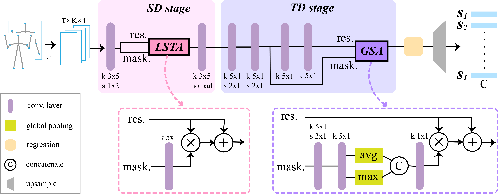

## AGANet (Attention-Guided Action Network)

[Paper](https://arxiv.org/abs/2007.01065) | 
[Poster](https://ailb-web.ing.unimore.it/icpr/media/posters/11730.pdf) |
[ICPR page](https://ailb-web.ing.unimore.it/icpr/author/2770)

This is the code implementation for **AGANet**, an attention-guided deep convolutional network
for skeleton-based action recognition, proposed by our paper "Attention-Oriented 
Action Recognition for Real-Time Human-Robot Interaction" in [ICPR 2021](https://www.micc.unifi.it/icpr2020/).



## Requirements
```
tensorflow 1.9.0
numpy
matplotlib (for visualization only)
```

## Core contents
```
datagen.py      # base Dataset
datagen_aug.py      # base Dataset + augmentation

cnn_model.py        # base CNN
cnn_model_att.py        # base CNN + attention
```

## How to use
```
python train.py     # Training

python test_AP.py
python test_cAP.py      # Quantitative evaluation

python error_analysis.py        # Compute confusion matrix
```

## Citation
```
@inproceedings{song2021attention,
  title={Attention-Oriented Action Recognition for Real-Time Human-Robot Interaction},
  author={Song, Ziyang and Yin, Ziyi and Yuan, Zejian and Zhang, Chong and Chi, Wanchao and Ling, Yonggen and Zhang, Shenghao},
  booktitle={2020 25th International Conference on Pattern Recognition (ICPR)},
  pages={7087--7094},
  year={2021},
  organization={IEEE}
}
```